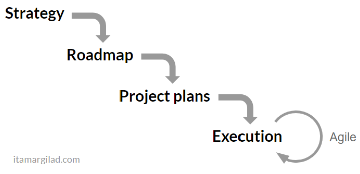
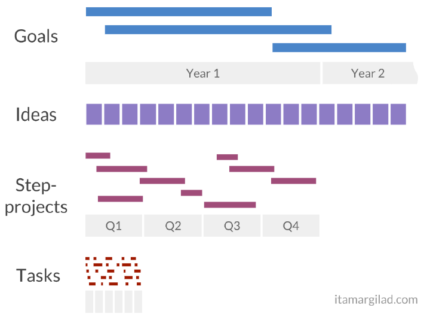

# GIST 计划优于产品里程碑管理

### 1 传统产品里程碑规划存在的问题

多年来大部分公司的产品策略依然是制定战略、规划里程碑、用甘特图跟踪项目，流程如下图：

每年或隔几年就做一次战略，然后在全年对产品进行里程碑拆分，最后制定详细的项目计划进行瀑布或敏捷开发，在运转过程中发现该模式存在几个问题，看你是否也感同身受：

+ 产品里程碑拆分比较困难，产品内外部形式变化如此之快，怎么能预见下半年几月几号应该具备什么功能呢？

+ 里程碑和项目计划制定后，基本固化了未来几月所做的事情，但按部就班去实现每个里程碑，如何确保每个里程碑值得开发，收效一定划算？

+ 每次发生局部调整，就需要花大量时间重做计划，太过浪费

+ 固化里程碑意味着拒绝新的Idea，随着开发进展，你总会积累很多更好的功能点、做法或者新思路，在该模型下没有地方来消化这些好主意

### 2 改进思路与GIST计划方法

分析一下，首先其实无论你的产品全年要做哪些事情，你的产品目标总是能明确的，突出重围还是占领市场份额，或者开始盈利等等；其次，在产品实现过程中，你总会不断的积累更好的做法的，用更好的做法能少踩坑，也可以提高投入产出比；最后，敏捷的幅度必须控制在短节点上，迭代一次需要几个月或半年的话，就不叫敏捷了，何况每次敏捷都是在试错，短节点的试错成本最小。

基于此，在Google工作过的Itamar Gilad产品经理提出了GIST计划方法，充分体现了Google OKR的管理思想。GIST是Goals,Ideas,Step-projects和Tasks的缩写，是产品推进的四个层面，每个层面都有独立的规划视角和变更频率，并可用不同的工具来跟踪，组合在一起基本能解决公司或团队的产品关键计划需要，如下图所示：

### 3 GIST 方法详述

#### Goals（目标）

> "If you tell people where to go, but not how to get there, you'll be amazed at the results"
>
>  --George S.Patton.

大多数战略规划总是以解决方案的方式来描述，更好的做法是遵循“使命命令原则”（the principle of Mission Command）用目标来描述战略，目标能涵盖战略意图，且不会随形势变化而变化，解决方案随形势变化有可能得调整；目标驱动原则包括：我们在什么时候、产品到达什么程度，以及我们怎么知道已到达目标。组织里每个人都想知道“我们为什么做这个项目？”，目标就能回答。这也是Google OKRs（Objectives and Key Results）成功的体现。

#### Ideas（主意）

> "If you want to have good ideas you must have many ideas. Most of them will be wrong, and what you have to learn is which ones to throw away"
>
> -- Linus Pauling

主意描述了到达目标的假设方式，关键就是“假设”，肯定有大量到达目标的主意，但至少三分之一存在副作用（或者更糟糕）。永远不要阻止主意的产生，让它们进入“优先级死亡竞赛”，选择那些让人兴奋的、靠谱的主意来实施。可以分为三步：

+ 收集所有主意到“主意银行”，可以用一个表格或数据库，所有的主意都欢迎，成百上千都没问题
+ 用各种证据来排列优先级
+ 让更多的主意具备可验证条件，也就是可以列为Step-projects

#### Step-projects（阶段性项目）

> "Think Big but Start Small"
>
> -- Google's 8 pillars of innovation

尝试选择一个可行的主意，转换为半年以上的项目执行，这是错误的，会付出高额成本。相反，把主意下面的大项目分解为小的阶段性项目，最长不超过2个月，经过mockup->prototype->MVP->beta->Launch，快速原型验证逐步实施。按照Build-Measure-Learn（构建、度量、学习）原则，没一个阶段性项目其实是对主意的一次验证，这本身就是产品成功过程的一部分，最终做出来的产品往往比你最初设想的要好。

#### Tasks（任务）

最后，每个阶段性项目可进一步分解为更细粒度的任务活动，你可以利用敏捷计划工具、看板或其它项目管理技术。唯一的区别就是，在任务进行的同时，其它层面的事情也在同时敏捷变化。

#### 计划闭环

GIST在计划闭环中，是多层次的，不断迭代的：

+ Goals目标设定1到几年的愿景，鼓励长期思考，年初制定，分季度实现；
+ Ideas主意被持续收集和排优先级，永远不要停止寻找新的主意；
+ Step-projects阶段性项目每季度挑选想做和值得做的目标和主意，阶段性项目每隔2周也要做一次优先级排序，并跟任务迭代保持同步；
+ Tasks任务在1到2周内按团队喜欢的开发方法进行推进，比如SCRUM等。

### 4 总结和启发

+ 主意、计划和执行不要分隔开，他们总是并行发生；
+ 目标比解决方案更优；
+ 主意银行(Idea bank)比产品待做功能项(product backlogs)更优；
+ 半季度阶段性项目比半年跨年项目更好，快速验证想法而不是让几个大想法永远无法实现
+ 迭代，定期审视计划的每一部分，在多个层次均同步保持敏捷

GIST套路对产品推进好用，在个人其它时间管理方面同样适用，曾经用过Project、待办事项、Any.do、奇思妙想、Doit.im(GTD)、Trello看板等各类工具，无论是Todo还是GTD模式，总是无法全貌描述一个目标和分解执行过程；从GIST角度来看，甘特图、Todo、看板都是Step-projects和Tasks短期计划安排，短期任务必须有明确的目标指引才有方向，杂事做的太多可能都是无用功，Idea主意的收集和整理也是很重要的环节，必须从任何地方任务途径寻求更多的主意，才能梳理出离目标更进一步的方法，层次不同，短期任务和长期目标做到同时兼顾。