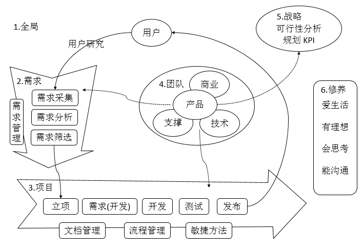

## 《人人都是产品经理》摘录笔记

​	作者苏杰可以算是大部分产品经理的启蒙和进阶老师了，给读者提供了大量实用的套路和指南。

**管理**

管理不是公司的管理层，如总裁、总监、经理们才需要掌握的技能，而是每个人必备的生存技能，只是每个人可以掌控的资源不同，所以需要管理的对象也不同。

管理的能力，其实就是”在资源不足的情况下把事情做成“的能力，这里的资源在产品经理的工作中通常表现为以下几种形式：

+ 第一，信息不足以决策
+ 第二，时间不足以安排周密的计划
+ 第三，人员不足以支持工作强度和难度
+ 第四，资金不足以自由调配

凡是资源，总归不足--这是常态。既然不足，就需要学会分配资源、管理资源。

**全书结构**

**需求**

人类生活在地球上，为什么会有各种各样的需求？那是因为生活中存在太多的问题，从而产生了不满意，而问题就是“理想与现实的差距”，那么人类会很自然地产生“减少甚至消除这个差距”的愿望，这就产生了需求。

理解用户是产品经理最重要的素质之一。

用户是User，有时也叫做终端用户，End User，是使用产品的人；而客户是Customer,是购买产品的人、为产品付钱的人。

试图满足所有用户的需求是一场灾难，那会让产品变成一个臃肿不堪，谁都不满意的四不像。我们无法满足所有用户的需求，要么关注核心用户的需求，要么优先满足大量一般用户的需求，这需要和产品的商业目标结合起来考虑。

用户访谈常见问题：

+ 第一，“说”和“做”不一致的问题
+ 第二，样本少，以偏概全的问题
+ 第三，用户过于强势，把我们往沟里带
+ 第四，我们过于强势，把用户往沟里带

听用户的，但不要照着做：

+ 用户需求：用户自以为的需求，并且经常表达为用户的解决方案
+ 产品需求：经过我们的分析，找到的真实需求，并且表达为产品的解决方案
+ 需求分析：从用户提出的需求出发，找到用户内心真正的渴望，再转化为产品需求的过程

需求满足的三种方式：

+ 改变现状
+ 降低理想
+ 转移需求
+ 创造需求

少做就是多做：情愿把一半的功能做到尽可能完美也不要把全部功能都做成半吊子。

**项目**

产品经理--靠想。产品经理是做正确的事，其所领导的产品是否符合市场的需求，是否能给公司带来利润。

项目经理--靠做。项目经理是把事情做正确，把事情做的完美，在时间、成本和资源约束的条件下完成目标。

**管理 VS. 领导**

管理更像科学，领导更像艺术；

管理靠的是权力，领导靠的是魅力；

管理者强调稳定，领导者喜欢冒险；

管理者依法治人，领导者以德服人；

管理的对象是行为，领导的对象是思维；

管理管正确的做事，领导管做正确的事；

管理是一步一个脚印，领导是不走寻常路；

管理者注重短期目标，领导者注重长期目标；

管理者是职业经理人，领导者是企业家和创业者；

管理是汽车的制动系统，领导是汽车的驱动系统；

管理是告诉团队怎么做，领导是告诉团队为什么做；

管理对人的影响由外而内，领导给人的力量由内而外；

管理让团队完成这些事，领导让团队喜欢做这些事。

**附录**

一个人真正成熟的标志之一，就是心中可以容纳互相矛盾的观点而无碍行事。

产品经理的关键职责：

+ 市场调研：最终会形成商业机会、产品战略或商业需求文档(BRD)，详述如何利用潜在的机会。
+ 产品定义及设计：产品需求文档(BRD) -- 产品的愿景、目标市场、竞争分析、产品功能的详细描述、产品功能的优先级、产品用例(Use Case)、系统需求、性能需求、销售及支持需求 等。
+ 项目管理：带领来自不同团队的人员（开发、测试、UI、市场、销售、客服等），在预算内按时开发并发布产品。
+ 产品宣介
+ 产品市场推广
+ 产品生命周期管理：产品定位、产品定价及促销、产品线管理、竞争策略、建立或收购合作伙伴、识别并建立合作关系等

产品经理的核心技能：

+ 沟通能力
+ 无授权领导能力
+ 学习能力
+ 商业敏感度
+ 热爱产品
+ 注重细节，追求完美
+ 日常产品管理能力

作者在书中还共享了一些经典的参考书籍：

+ 《Don't Make Me Think》
+ 《赢在用户-Web任务角色创建和应用实践指南》
+ 《动机与人格》马斯洛
+ 《黑天鹅：如何应对不可预知的未来》纳西姆-尼古拉斯-塔勒布
+ 《情感化设计》唐纳德-A-诺曼
+ 《设计心理学》
+ 《人件》
+ 《统计数字会撒谎》
+ 《产品经理的第一本书》
+ 《别做正常的傻瓜》
+ 《美第奇效应》
+ 《水平营销》
+ 《蓝海战略》
+ 《公司进化论：伟大的企业如何创新》
+ 《跨越鸿沟》

**后记**

作者对职场人员的职场能力竞争力提供了良好的建议：打造个人品牌，无论是写专业博客或社交身份运营，甚至提供高质量的Github，都可以给个人带来好的标签和印象分，真正成为个人的核心竞争力积累，而不是每次换工作貌似都要从零开始。